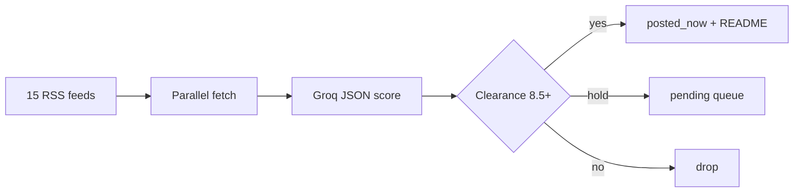

<p align="center">
  
</p>

<h1 align="center">NEXUSFEED</h1>

<p align="center">
  <code>SHORTWAVE FOR SOFTWARE + AI</code><br>
  <sub>RSS noise in &nbsp;·&nbsp; scored clearance out &nbsp;·&nbsp; zero servers</sub>
</p>

<p align="center">
  <a href="https://github.com/mohabdelkarim/NexusFeed/actions/workflows/news_bot.yml"></a>
  &nbsp;
  
  &nbsp;
  
  &nbsp;
  
</p>

<br>

<p align="center"><b>This repository is the product.</b> A curator listens to fifteen feeds, asks Groq for a hard score, kills duplicates, and stamps only the clears onto this page.</p>

```text
   ∿∿∿  tune  →  weigh  →  gate  →  stamp  ∿∿∿
   feeds        Groq       8.5+      README
```

<!-- POST_NOW_START -->
<a id="open_channel"></a>
## OPEN CHANNEL

<p align="center"><code>CLEARANCE 8.5+ &nbsp;//&nbsp; LIVE FROM ACTIONS &nbsp;//&nbsp; NOISE FILTERED</code></p>

<table>
<tr><td width="100%">

#### `09.0`&nbsp;&nbsp;█████████░&nbsp;&nbsp;`Google AI` · `Aug 11` · tier `S`
**01.** [AMIE, our research medical AI system, demonstrates real-time clinical video consultation…](https://blog.google/innovation-and-ai/models-and-research/google-research/amie-video-consultations)

<br/>

#### `08.5`&nbsp;&nbsp;████████░░&nbsp;&nbsp;`Wired AI` · `Aug 11` · tier `A`
**02.** [AI Is Dead. Organoids Are Alive](https://www.wired.com/story/organoids-lab-grown-brains-neural-networks)

<br/>

#### `08.5`&nbsp;&nbsp;████████░░&nbsp;&nbsp;`The Verge` · `Aug 07` · tier `A`
**03.** [OpenAI puts the brakes on a new model because it’s supposedly too powerful](https://www.theverge.com/ai-artificial-intelligence/976948/openai-astra-model-pause-critical-cyber-capabilities)

<br/>

#### `08.5`&nbsp;&nbsp;████████░░&nbsp;&nbsp;`Wired AI` · `Aug 07` · tier `A`
**04.** [Scientists Used AI to Create 16 New Viruses](https://www.wired.com/story/scientists-used-ai-to-create-16-new-viruses)

<br/>

#### `08.5`&nbsp;&nbsp;████████░░&nbsp;&nbsp;`MarkTechPost` · `Jul 31` · tier `A`
**05.** [JetBrains Open-Sources KotlinLLM: Smart Macros That Generate Kotlin Source Code at Runtime and…](https://www.marktechpost.com/2026/07/31/jetbrains-research-open-sources-kotlinllm-intellij-plugin-kotlin-runtime-llm)

<br/>

#### `08.5`&nbsp;&nbsp;████████░░&nbsp;&nbsp;`The Verge` · `Jul 14` · tier `A`
**06.** [Meta accused of using biased AI targeting for mass layoffs](https://www.theverge.com/tech/965486/meta-lawsuit-former-employees-ai-layoffs)

<br/>

#### `08.5`&nbsp;&nbsp;████████░░&nbsp;&nbsp;`TechCrunch` · `Jul 14` · tier `A`
**07.** [Spotify expands its AI push with a ChatGPT-like music assistant](https://techcrunch.com/2026/07/14/spotify-expands-its-ai-push-with-a-chatgpt-like-music-assistant)

<br/>

#### `08.5`&nbsp;&nbsp;████████░░&nbsp;&nbsp;`InfoQ AI/ML` · `Jul 10` · tier `B`
**08.** [Linux Foundation Launches Akrites to Protect Critical Open Source Software from AI-Powered…](https://www.infoq.com/news/2026/07/akrites-open-source-ai-threats)

</td></tr>
</table>

<p align="center"><sub>CHANNEL HOLDING 8 CLEARS · FULL TAPE IN <code>posted_now.json</code></sub></p>

<!-- POST_NOW_END -->

## Signal path



Novelty · Impact · Freshness · Source authority. Local red flags override the model when a story smells like a listicle. Canonical URL hashing keeps the same piece from returning in a new outfit.

## Bring the desk online

```bash
git clone https://github.com/mohabdelkarim/NexusFeed.git
cd NexusFeed
python -m venv .venv
```

```bash
# macOS / Linux
source .venv/bin/activate

# Windows PowerShell
. .venv/Scripts/Activate.ps1
```

```bash
pip install -r requirements.txt
cp .env.example .env
```

Drop your `GROQ_API_KEY` into `.env`, then:

```bash
python main.py
```

Same secret in Actions. The desk opens Tuesday and Friday.

<details>
<summary><code>// operator notes</code></summary>

<br>

**Knobs** in `news_bot.py`: `FEEDS` · `POST_NOW_MIN_SCORE` · `MAX_POSTS_PER_DAY` · `RED_FLAG_PATTERNS`

**Side channels**

```bash
python daily_digest.py
python check_feeds.py
python -m unittest discover -s tests -v
```

**Band list** · OpenAI · Anthropic · Google AI · Hugging Face · Microsoft AI · TechCrunch · The Verge · Ars Technica · MarkTechPost · Wired AI · MIT News · InfoQ · AI News · arXiv cs.AI · Hacker News

**License** · MIT

</details>
